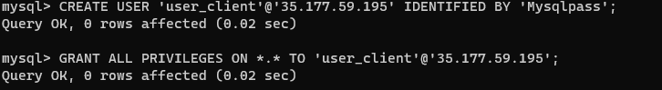
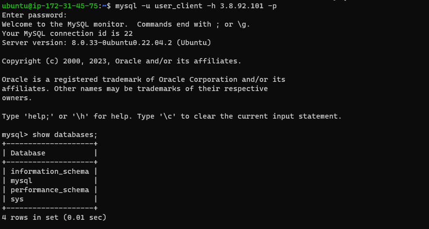

# IMPLEMENT A CLIENT SERVER ARCHITECTURE USING MYSQL DBMS

The client-server architecture is a popular approach in software development where a centralized server provides services or resources to multiple client devices. In the context of implementing a client-server architecture using MySQL, we leverage the power of MySQL, a popular open-source relational database management system, to store and manage data on the server side.

The goal of this project is to demonstrate the establishment of a client-server architecture where clients can interact with the MySQL server to access, manipulate, and retrieve data. The MySQL server acts as a centralized repository for storing and organizing the data, while clients connect to the server to perform various operations.

## INFRASTRUCTURE

I will be using 2 EC2 instances for this project. One will be for the server and the other for the client.

## SERVER A -MYSQL SERVER

An EC2 instance is launched and named MYSQL SERVER. I will be installing MySQL Server software on the 'MYSQL SERVER' instance using the following code: 
`sudo apt update`
`sudo apt install mysql-server`

## SERVER B- MYSQL CLIENT

Another EC2 instance is launched and named MYSQL CLIENT. I will be installing MYSQL Client software here with the following commands

`sudo apt update`
`sudo apt install mysql-client `

## CONFIGURE MYSQL SERVER

The configuration file is accessed to allow remote connections to MYSQL server using the code below:

`sudo vi /etc/mysql/mysql.conf.d/mysqld.cnf`

I change Find the line that says bind-address = 127.0.0.1 and change it to bind-address = 0.0.0.0. This allows remote connections to the MySQL Server. 

.PNG)

MySQL service is restarted for the changes to take effect:

`sudo service mysql restart`

## Allow Remote Access to MySQL Server

On the AWS console, go to the "mysql server" instance's Security Group settings.
Edit the inbound rules and add a new rule to allow incoming TCP traffic on port 3306 (MySQL default port) from the IP address of the "mysql client" instance. This restricts access to the specific local IP address of the "mysql client".

## CREATE A NEW USER ON MYSQL SERVER 

A new user is created on mysql-server with the following code as shown below: 

Note: '35.177.59.195' is the ipaddress of mysql-client

## CONNECT TO MYQL SERVER

I connect to mysql server from mysql client as shown below:

## CONCLUSION

In this project, I have demonstrated how to implement a client-server architecture using MySQL. I have created two EC2 instances, one for the server and one for the client. I have installed MySQL Server software on the server and MySQL Client software on the client. I have configured the server to allow remote connections and created a new user with access to the database. I have then connected to the server from the client and run some SQL queries.

This project has provided me with a good understanding of how to implement a client-server architecture using MySQL. I can now use this knowledge to build more complex applications that require a centralized database.